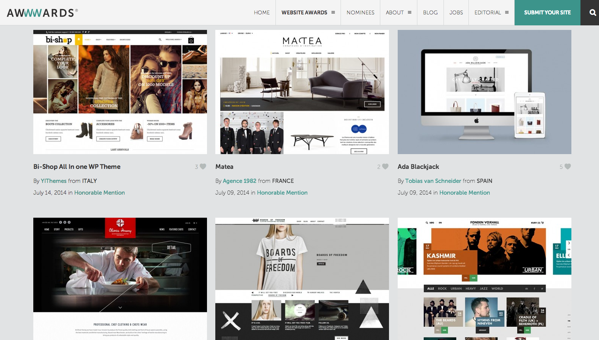

Desde o fim da faculdade, sempre tive vontade de encontrar uma forma de compartilhar com meus amigos os pequenos detalhes que separam um layout offline do online. Afinal, quem nunca recebeu um convite pra fazer um freela online ou até mesmo uma vaga de emprego?

## Introdução

Pra colocar minha promessa em prática, eu vou precisar adotar uma maneira bem informal e descompromissada de passar esses conhecimentos. Design para web é muito, muito, muito… muito além do que um punhado de layouts. Mas desenhar as telas é um _mau necessário_, então, vamos ao que interessa.

> _Ainda me surpreendo quando vejo times de Design gastando a maior parte das horas de um projeto montando layouts no Photoshop. O layout é só 10% do trabalho. **por Fabricio Teixeira** [ler o artigo completo](http://arquiteturadeinformacao.com/user-experience/fazer-layout-e-so-10-trabalho/) **#dica**_

.   .   .

Uma questão fundamental que o designer do mundo off precisa ter em mente é que: **Web é 72dpi**. Esse é o start de qualquer coisa que você for fazer para web. Seja um banner ou seja um anúncio de Facebook.
Se você já sabe mexer no Photoshop, vai ser mais fácil. Para aqueles que usam o Illustrator, que não é o mais recomendado mas pra começar a treinar da pra usar, porém lembrando sempre de configurar a resolução para 72dpi.
Aos amigos que usam Corel Draw… eu espero que seja uma fase bem passageira e que vocês se livrem dela logo.

## Os Tamanhos

Em meio a notebooks, iMacs gigantescos, tablets e smartphones, realmente da um nó na cabeça na hora de pensar o tamanho do layout. Ainda mais com a chegada dos sites responsivos, é aí que o bicho pega. Vamos dividir em duas partes esse assunto, vou dar o nome de Sites Comuns, para os não-responsivos.

**Atenção:** É praticamente um crime desenvolver um site hoje e ele não ser responsivo, porém, este post tem a intenção de introduzir os elementos do Design para Web à iniciantes. Pretendo escrever em breve sobre design responsivo voltado para designers. Um passo de cada vez. ☺

1. **Medidas para sites comuns**

Largura máxima do conteúdo: **960px a 1000px**
Altura do primeiro scroll: **500px a 600px**

As telas mais populares para esses tipos de site são, da menor para a maior: Tablet (no modo horizontal), Notebook e Desktop.

_Você pode até se perguntar: Mas eu consigo abrir um site comum na telinha do meu smartphone! Sim, você consegue, mas vai dar rolagem e/ou vai aparecer numa resolução muito pequena e ilegível, teria que dar zoom pra ler. Por isso, existem os sites responsivos, pra poder organizar o conteúdo do site de forma adequada para o tamanho da tela. Porém, estamos neste momento falando do site comum._

**#dica** Existe um plugin ~maravilhoso~ para o Google Chrome, chamado **[Window Resizer](https://www.google.com.br/url?sa=t&rct=j&q=&esrc=s&source=web&cd=1&cad=rja&uact=8&ved=0CB4QFjAA&url=https%3A%2F%2Fchrome.google.com%2Fwebstore%2Fdetail%2Fwindow-resizer%2Fkkelicaakdanhinjdeammmilcgefonfh&ei=WP7PU9mULIO-sQT76YKQCg&usg=AFQjCNEO7L8zwQXMTMkbg_8KRGDgpQLGqg&sig2=pAWGRIebT09gKjkx2NwcdQ&bvm=bv.71667212,d.cWc)**. Acesse alguns sites e experimente o plugin. Ele vai simular várias telas redimensionando o browser para diversos tamanhos, assim, você pode ver o comportamento dos sites e entender a relação conteúdo versus background e outros detalhes mais.

iPad 1024x768

Netbook ou Notebook 1280x800

Desktop pequeno
1280x1034

Abaixo um esquema simples para aqueles que confundem conteúdo e background na hora de pensar nos 1000px. E também uma explicação básica sobre os 500px do primeiro scroll.

#### Entender algumas regras pra então depois quebrá-las

É importante saber dos 500px de altura do primeiro scroll, porque assim você sabe mais ou menos até onde seu conteúdo de destaque irá se apresentar ao usuário.

E como você pode observar nos exemplos anteriores, dependendo da tela, o conteúdo fica cortado, então se é importante que determinado destaque apareça por inteiro, pense nisso: 500 a 600px de altura mínima.

[O exemplo](http://gnarly.clothing/) que utilizei acima é um site responsivo, mas pra exemplificar eu simulei como se não fosse responsivo no modo Tablet (está muito difícil encontrar um site não-responsivo hoje em dia, e que bom isso).

2. **Medidas para sites responsivos**

A grosso modo me arrisco dizer que, um site responsivo nada mais é do que um _site comum_ que se adapta de forma inteligente a qualquer tamanho de tela. O responsivo sabe aproveitar o espaço que lhe compete. Ao abrir um site na versão mobile, alguns conteúdos que não são tão relevantes, são ocultados, e assim por diante. **#dica** O site [Media Queries](http://mediaqueri.es/) mostra vários exemplos de páginas se comportando de maneira responsiva.

Abaixo, um videozinho que mostra como você observa se um site é responsivo e como ele funciona:

<iframe src="https://player.vimeo.com/video/101016205" width="640" height="378" frameborder="0" allow="autoplay; fullscreen" allowfullscreen></iframe>

<a href="https://vimeo.com/101016205">Exemplo de responsivos</a> from <a href="https://vimeo.com/user13106117">Mariana Silva</a> on <a href="https://vimeo.com">Vimeo</a>.

A qualidade do vídeo ta bem ruim, e ta um pouco lento, desculpe. Mas, pratique isso com todos os sites. Youtube, Facebook e etc.

Esse infográfico explicou a minha dificuldade em encontrar um site comum pra exemplificar lá em cima.

_Um ponto importante em comum que encontramos nos dois tipos de site é a questão da adaptação da imagem. Nos sites comuns, as imagens são responsivas._

**#dica** Para [saber mais](http://sergiolopes.org/responsive-web-design/) sobre Responsive Design.

##Converse mais com seus amiguinhos

Front-end é a pessoa que você tem que ser muito amiga. Converse com ele ou ela antes, durante e depois do desenvolvimento do projeto. Principalmente pra quem ta iniciando. Saber um pouco de HTML também é importante. Isso vai te ajudar a entender melhor o porque das coisas.

**#dica** Existem várias iniciativas maravilhosas que ensinam HTML de forma interativa e divertida, e uma delas é o **[Codecademy](http://www.codecademy.com/)**. Totalmente gratuito, a ferramenta te guia passo-a-passo através de lições super fáceis de aprender. ~Vai que~ você não se anima e vira um designer/programador? Vai ficar ryca ney! Existe também o **[Code School](https://www.codeschool.com/)**, esse eu nunca usei mas é bem falado.

**#dica** Um hábito muito bom, é saber usar o **Inspect Element** do Chrome, ou Fire Bug. Depende do navegador que você usa, cada um tem um nome. Com ele você pode "camilar(\*)" varias coisas dos sites e descobrir como funcionam. Abaixo um videozinho que mostra, e com um plus de um outro plugin ~_maravilhoso_~.

<iframe src="https://player.vimeo.com/video/101020729" width="640" height="410" frameborder="0" allow="autoplay; fullscreen" allowfullscreen></iframe>

<a href="https://vimeo.com/101020729">inspect the elemente</a> from <a href="https://vimeo.com/user13106117">Mariana Silva</a> on <a href="https://vimeo.com">Vimeo</a>.

Veja em fullscreen, fica melhor.

- camilar era um termo que a gente usava na faculdade, pra designar furto. Lovely. Sdds.

## Um pouco sobre inspiração

Saber observar um layout faz diferença na hora de aplicar referências ao seu trabalho.
Existem milhares de layouts lindos do tipo concept que enchem nossos olhos, essa modalidade até ganhou um artigo muito interessante que eu citei lá na introdução, mas agora vou postar o link mais direto aqui, [A Dribbblização do design](https://www.intercom.com/blog/the-dribbblisation-of-design/).

Eu não gosto de recomendar o famoso e _overrated_ [Awwward](http://www.awwwards.com/css-gallery/) como uma referência, pois o nível da programação que se deve ter num projeto daqueles é muito avançada e cara. Logo, você pode fazer um layout lindo, porém surreal demais para ser executado. É preciso ter muita cautela pra saber aproveitar a inspiração. Se inspire num tipo de fonte, num estilo de título, na barra de menu. Garimpe por partes. Masss, como toda regra tem uma exceção, esses dias eu pesquisei na categoria [E-commerce](http://www.awwwards.com/websites/e-commerce/), e encontrei referências mais de acordo com a demanda brasileira.

**#dica** Aqui, uma lista razoável de links de referência para layout web:

- http://www.thebestdesigns.com/
- http://bestwebgallery.com/
- http://www.siteinspire.com/
- http://www.webdesignserved.com/
- http://www.cssawards.net/
- http://mediaqueri.es/
- http://www.awwwards.com/awards-of-the-day

Referência é bom, mas a melhor solução pro seu layout você vai encontrar atendendo a necessidade do conteúdo real. Te-lo antes de criar um layout seria o ideal. Mas muitos de nós ainda vive "em um mundo" em que vão te pedir pra fazer um layout pra um cliente que nem o logo, muito menos identidade visual tem, quanto mais o conteúdo real.

## Web Font

Saber escolher bem a fonte para estilizar os textos antes de iniciar o layout é uma questão que vai além da estética. É um item que afeta diretamente no desenvolvimento, principalmente se for uma fonte que não pertence a categoria das WebFonts. Esse é um assunto que também da um post inteiro, mas vamos resumir: WebFont, ou fonte de sistema, é o nome que se dá a todas as fontes que o site vai utilizar buscando diretamente da máquina do usuário, por esse motivo elas serão exibidas sem problema pelos navegadores.

Há um tempo atrás, muitos designers eram escravos da lista básica _e arcaica_ de fontes web, as clássicas: Arial, Verdana, Tahoma, Georgia, Trebuchet, Times New Roman e algumas outras que não vou me lembrar agora. A Times por ser serifada demais, raramente foi usada. Elas são sem dúvidas as que menos vão te dar dor de cabeça quando o dev pegar o layout pra desenvolver.

_(agora leia com voz de locutor narrando a chegada de um super-herói)_
Mas eis que em meados dos anos de 2012, surge como um faixo de luz na escuridão o [Google Fonts](https://www.google.com/fonts)! Ele é um facilitador pra vida do desenvolvedor, e te da muito mais opções pra deixar seu layout mais original. (fecha a voz)

Vale ressaltar que, em se tratando de texto na web, geralmente a fonte é pequena por isso é indicado o uso de fontes Sans Serif. Fontes serifadas somente se o texto for bem tratado assim como é aqui no Medium, por exemplo.

#### Que tamanhos de fonte usar?

**#dica** Sobre os tamanhos que você deve usar num layout básico web, podemos consultar o lindo e maravilhoso [Bootstrap](https://getbootstrap.com/) (aquele que deixa todos os sites com a mesma cara), além disso você pode descobrir vários outros padrões utilizados na web pra você ficar por dentro e não deixar o dev bravo.

Agora um assunto muito sério, legibilidade. Parece óbvio mas já vi designer formado cometer esse crime! Sempre que for colocar uma fonte cinza num fundo branco, se pergunte com sinceridade: Ta dando pra ler? Tá chato de ler? Se eu escurecesse um pouco mais ficaria melhor? Se sim. Então escureça. Um conteúdo importante não pode ser eclipsado por questões estéticas. Se é importante, tem que aparecer.

## Ícones

**#dica** Ícones são elementos que fazem a diferença no design de uma página ou aplicativo. Hoje em dia existem várias iniciativas que facilitam a implementação deles de forma mais amigável, ou seja, ao invés do front-end ter que implementar o ícone como uma pequena imagem, ele pode fazer isso como se ele fosse um font-face, com [Font Awesome!](https://fontawesome.com/) _everything is awesome_. E não só o front-end mas você designer também pode desfrutar da grande variedade de ícones.

## Grid

Como pude esquecer de grid! Na verdade não esqueci, mas é um assunto extenso e foge do propósito desse artigo, porém é importante passar por ele. Por isso, leiam a apresentação no link abaixo que fala de maneira direta sobre grids, principalmente a partir do slide 10 . Espero poder entrar em mais detalhes sobre grid quando eu voltar aqui no Medium pra falar sobre Layout para Design Responsivo.

**#dica** [A importância do Grid para o Design de interfaces Web](http://pt.slideshare.net/eduardobrandao/a-importncia-do-grid-para-o-design-de-interfaces-web)

As páginas internas são a continuação do projeto, sendo assim, devem dar seguimento também ao visual criado na home. Manter a paleta de cores, detalhes e outras semelhanças fortalece a identidade do projeto e dá a sensação ao usuário de que ele continua no mesmo site que entrou lá no início da navegação.

**#Dica** Antes de começar um layout, faça um esquema no papel, para que se tenha uma noção da organização do conteúdo na página. Principalmente quando você tem muitas telas pra fazer. Costumo também desenhar uma espécie de mapa, onde listo cada tela, e se tiver alguma observação, fica mais prático de enxergar, e assim também não me esqueço de fazer nenhuma tela.

Observe em sites de referência, como eles lidam com as diferenças entre as páginas, como por exemplo, Contato e Sobre, e ainda assim conseguem manter a consistência visual.

Abaixo uma pequena relação de telas que geralmente os designers se esquecem de fazer, e eu me incluo nessa lista, são:

- Mensagem de erro em formulário (como vai aparecer o aviso ao user)
- Página de Regulamento, Política de Privacidade e Faq
- Tela do usuário Logado
- Erro 404 (I’ll tell you a secret: nunca fiz essa, mas também nunca me pediram, humpf)

Geralmente esses links estão lá no rodapé, bem escondidos, aí a gente se preocupa em fazer as telas do menu principal e se esquece dessas, normal.

Chegamos ao fim dessa coisa que eu não sei se chamo de artigo, de post ou página, enfim. Espero que tenham gostado e sobre tudo que lhes seja útil.

Gostaria de receber feedbacks. Se você viu algo errado, se você quer contribuir com algum link ou qualquer coisa, envie suas sugestões para mariana05alves@gmail.com. Meu portfólio está em construção, em breve atualizo aqui.

Command (ou ctrl) + f, digita **#dica** e assim você tem a lista dos links e dicas que estão espalhadas pelos texto.

Valeu ;)
